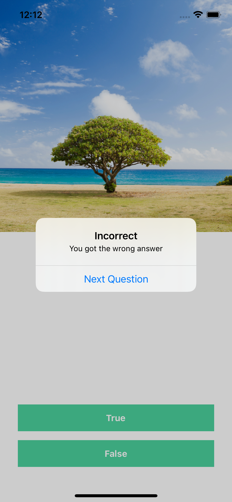
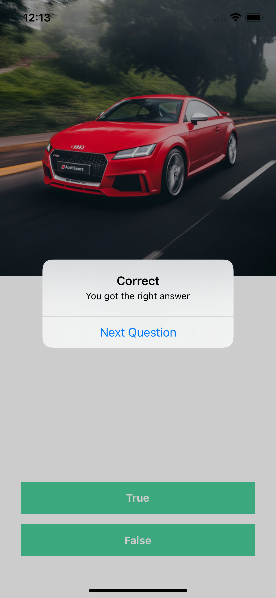
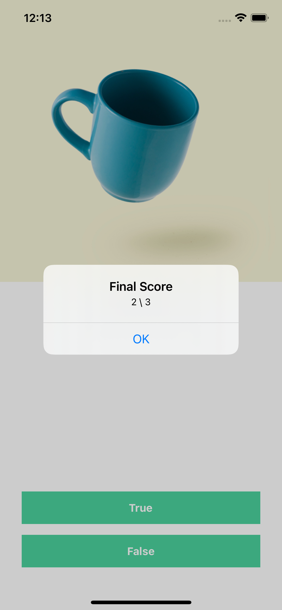

# UIKit - MyQuiz
 

  
  

  

## Features

- [x] Question in array
- [x] Operators and conditions to check the answer

## Requirements

- iOS 9.0+

## Installation

There is no dependency for this app.

## Usage 

Clone the project and run in your local workstation.

## Contact
Created by [@Hung-Chun, Tsai (Carter)](linkedin.com/in/hung-chun-carter-tsai-372584175) - feel free to contact me!

<i>Follow me around the web:</i> 

<!-- <a target="_blank" href="https://www.linkedin.com/in/hung-chun-carter-tsai-372584175/">🇱​🇮​🇳​🇰​🇪​🇩​🇮​🇳​</a> ●
<a target="_blank" href="https://www.instagram.com/hungchun.tsai/">🇮​🇳​🇸​🇹​🇦​🇬​🇷​🇦​🇲​</a> ●
<a target="_blank" href="https://www.facebook.com/hongjun.cai.5">🇫​🇦​🇨​🇪​🇧​🇴​🇴​🇰​</a> ● -->

